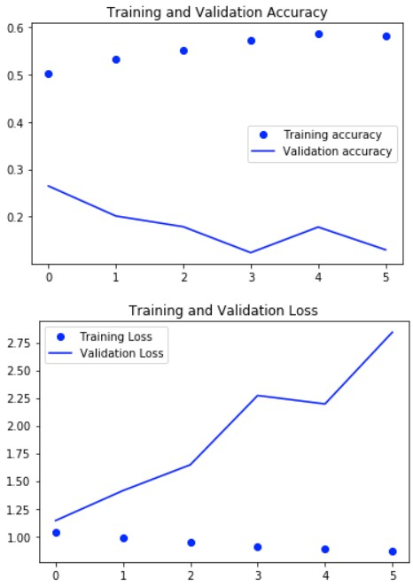
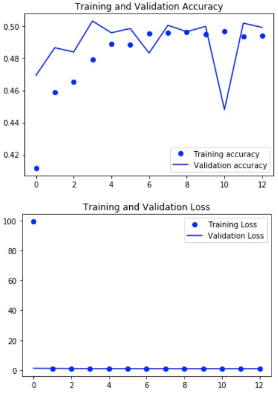

# MRI Recognition with Keras and Tensorflow

Build a CNN using Keras + Tensorflow to predict the rating of an MRI into Mild Demented, Moderate Demented, Non Demented or Very Mild Demented.

* Tensorflow and Keras

They are the most used and most researched libraries for Deep Learning.

* CNN

Mainly used for image classification.

- How does it work?

Convolutional filters are used to extract features from images. It is no longer necessary to define which features or the values that are needed to acquire these features. The network does this job. Depending on the quantity of filters and layers, the network can learn several features at the same time.

## *_Data Input_*

With Python OpenCV | cv2.imread() method loads the image:
```
array([[[0, 0, 0],
        [0, 0, 0],
        [0, 0, 0],
        ...,
        [0, 0, 0],
        [0, 0, 0],
        [0, 0, 0]],

       [[0, 0, 0],
        [0, 0, 0],
        [0, 0, 0],
        ...,
        [0, 0, 0],
        [0, 0, 0],
        [0, 0, 0]],

       [[0, 0, 0],
        [0, 0, 0],
        [0, 0, 0],
        ...,
        [0, 0, 0],
        [0, 0, 0],
        [0, 0, 0]],

       ...,

       [[0, 0, 0],
        [0, 0, 0],
        [0, 0, 0],
        ...,
        [0, 0, 0],
        [0, 0, 0],
        [0, 0, 0]],

       [[0, 0, 0],
        [0, 0, 0],
        [0, 0, 0],
        ...,
        [0, 0, 0],
        [0, 0, 0],
        [0, 0, 0]],

       [[0, 0, 0],
        [0, 0, 0],
        [0, 0, 0],
        ...,
        [0, 0, 0],
        [0, 0, 0],
        [0, 0, 0]]], dtype=uint8)
```
And with the _shape_ function I get the image size:
```
(208, 176, 3)
```
I used _ImageDataGenerator_ to read the images from disk and set aside 30% of the data for validation. It is not necessary to normalize the images to the 0 to 1 range in this case.

```
Found 3586 images belonging to 4 classes.
Found 1535 images belonging to 4 classes.
```

The network will read 50 images at a time, according to the chosen *_batcth_size_*. I created a generator for training and validation. In _class_mode_ I added “categorical” because there were 4 classes in my dataset. If there were two, for example, I would choose binary.

## *_Model Building | Network Architecture_*

Create a small network that could identify the images.

1. The convolutional layer will define the filters. In the first layer I have 64 filters, each filter is 2x2 in size. The activation used was _relu_ which is a simple activation where values ​​less than zero are removed;
2. Added a MaxPooling layer that downsamples the sample. It allows you to process more, reducing the resolution, and generalize and avoid a bit of overfitting. And the main layer that's used to actually handle overfitting is _Dropout_. How does _Dropout_ work? In each round 30% of the neurons it will deactivate to generalize my model and avoid overfitting;
3. I repeat the same layer but with 128 filters;
4. I do a _Flatten_. What was a convolution is turned into an array;
5. Step to a _Dense_ layer and add one more _Dropout_;
6. Step to the output layer that will have 4 neurons (4 classes) and add in this layer the _softmax_, which is a function that produces a probability distribution for each image class during a classification, different from the _sigmoid_ capable of dealing with only two classes;

## *_Architecture Result_*

The _Dense_ layer has more parameters to learn. The more _Dense_ layers are added, the heavier the net becomes.

```
Model: "sequential_1"
_________________________________________________________________
Layer (type)                 Output Shape              Param #   
=================================================================
conv2d_2 (Conv2D)            (None, 99, 99, 64)        832       
_________________________________________________________________
max_pooling2d_2 (MaxPooling2 (None, 49, 49, 64)        0         
_________________________________________________________________
dropout_3 (Dropout)          (None, 49, 49, 64)        0         
_________________________________________________________________
conv2d_3 (Conv2D)            (None, 48, 48, 128)       32896     
_________________________________________________________________
max_pooling2d_3 (MaxPooling2 (None, 24, 24, 128)       0         
_________________________________________________________________
dropout_4 (Dropout)          (None, 24, 24, 128)       0         
_________________________________________________________________
flatten_1 (Flatten)          (None, 73728)             0         
_________________________________________________________________
dense_2 (Dense)              (None, 256)               18874624  
_________________________________________________________________
dropout_5 (Dropout)          (None, 256)               0         
_________________________________________________________________
dense_3 (Dense)              (None, 4)                 1028      
=================================================================
Total params: 18,909,380
Trainable params: 18,909,380
Non-trainable params: 0
_________________________________________________________________
```

## *_Compilation_*

Definition of how the network will learn: loss function and optimizer. 

I used the default _adam_ optimizer, the loss used was _categorical_crossentropy_ which is used when there are two or more label classes and accuracy as a metric.

```
model.compile(loss = 'categorical_crossentropy',
             optimizer = 'adam',
             metrics = ['accuracy'])
```

## *_Training_*

In Keras, you can add _callbacks_ that are called during training. 

In this case, I added two: _EarlyStop_ (stops training if the wall network learns) and _ModelCheckPoint_ (saves the model that has the best loss during training). At _EarlyStop_ you have to wait 5 epochs if it doesn't decrease for 5 epochs then stop.

I determined 50 epochs for training but the model only trained for 6 epochs, because of _EarlyStop_. 

```
Epoch 1/50
71/71 [==============================] - 52s 733ms/step - loss: 1.0380 - accuracy: 0.5091 - val_loss: 1.1420 - val_accuracy: 0.2647

Epoch 00001: val_loss improved from inf to 1.14198, saving model to C:\Users\RenanSardinha\Documents\Data Science\Projects\MRI-Classification-Tensorflow-Keras\sequential
INFO:tensorflow:Assets written to: C:\Users\RenanSardinha\Documents\Data Science\Projects\MRI-Classification-Tensorflow-Keras\sequential\assets
Epoch 2/50
71/71 [==============================] - 54s 758ms/step - loss: 0.9911 - accuracy: 0.5272 - val_loss: 1.4124 - val_accuracy: 0.2013

Epoch 00002: val_loss did not improve from 1.14198
Epoch 3/50
71/71 [==============================] - 53s 742ms/step - loss: 0.9744 - accuracy: 0.5358 - val_loss: 1.6457 - val_accuracy: 0.1787

Epoch 00003: val_loss did not improve from 1.14198
Epoch 4/50
71/71 [==============================] - 53s 749ms/step - loss: 0.9010 - accuracy: 0.5752 - val_loss: 2.2713 - val_accuracy: 0.1240

Epoch 00004: val_loss did not improve from 1.14198
Epoch 5/50
71/71 [==============================] - 56s 788ms/step - loss: 0.8866 - accuracy: 0.5937 - val_loss: 2.1952 - val_accuracy: 0.1780

Epoch 00005: val_loss did not improve from 1.14198
Epoch 6/50
71/71 [==============================] - 56s 785ms/step - loss: 0.8784 - accuracy: 0.5775 - val_loss: 2.8427 - val_accuracy: 0.1300

Epoch 00006: val_loss did not improve from 1.14198
Epoch 00006: early stopping
```

## *_Image Augmentation_*

In the first step I didn't use Image Augmentation. The accuracy on the training set was 57.75%. But on the validation set it’s much smaller at 13% and on the Plot chart the loss drastically increasing on the validation set. So that’s clearly showing overfitting.



Using image augmentation, the accuracy on the training (47.86%) and the validation (49.93%) set are now close to each other. On the Plot chart we can see the accuracy curves are fit near, except at epochs 0 and 10, and the loss are fit together, except at epoch 0.



## *_Predictions_*

I chose an image from the VeryMildDemented class for the classify model. And the model correctly classified the label.
Labels: 
```
{'MildDemented': 0,
 'ModerateDemented': 1,
 'NonDemented': 2,
 'VeryMildDemented': 3}
```
Result:
```
Score [[0. 0. 0. 1.]]
Label: 3
```

## *_Data_*

Data were extracted from Kaggle: https://www.kaggle.com/tourist55/alzheimers-dataset-4-class-of-images
